# VCriate QuizApp 🤖

This is an Basic QuizApp based on the Information provided in the Intern hiring task and JSON data fetched from API.
The app first lists a set of questions which are available in the JSON data. User can tap on a single question to view it's details and attempt it.

Because of the time constraint, I was not able to implement the following features:
- Showing the correct answer after the user has attempted the question.

## Features
- Login and Signup using Google Sign In as well as Email and Password.
- List of Questions fetched from API.
- User can attempt a question and view the result.
- User can update his/her profile.
- User can share the result of the quiz with his/her friends.
- Timer for Quiz.

## Screenshots and Videos
https://user-images.githubusercontent.com/84123733/193307586-2bb6f91d-2b50-4b9f-b5be-0d3b9b4f5797.mp4
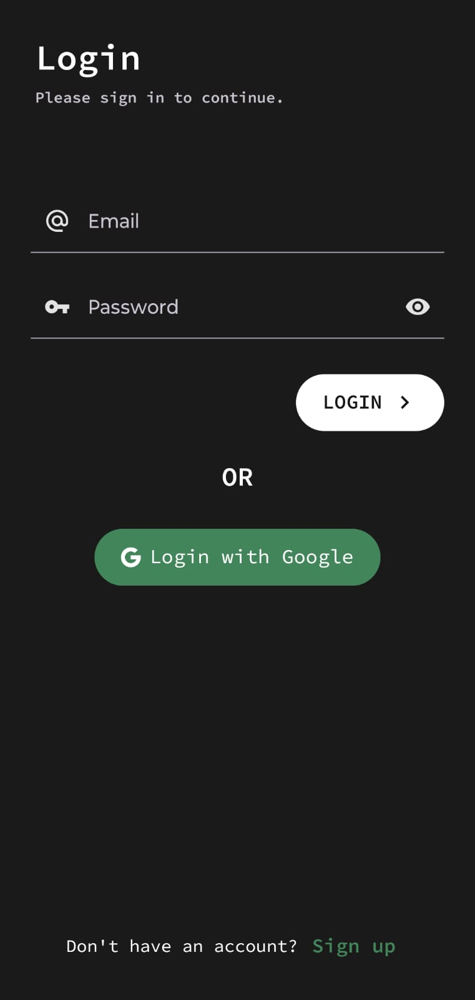 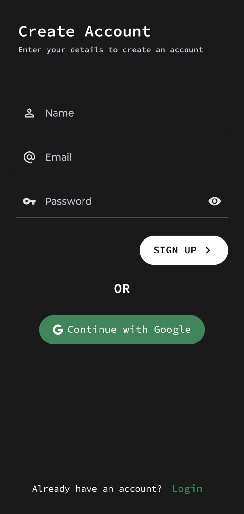 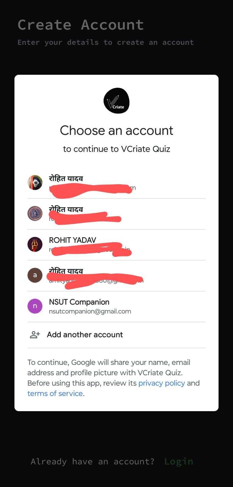 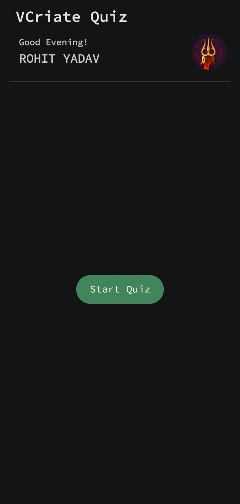 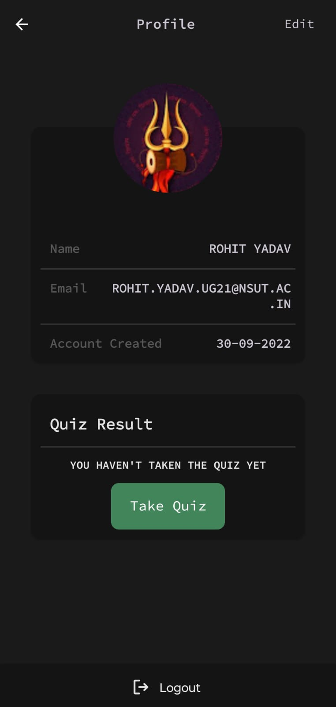  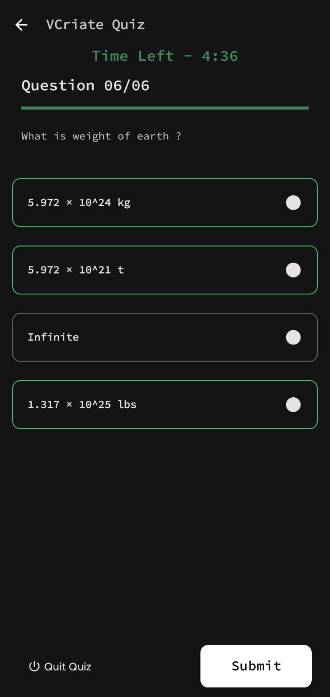 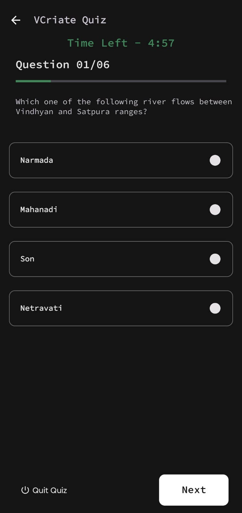 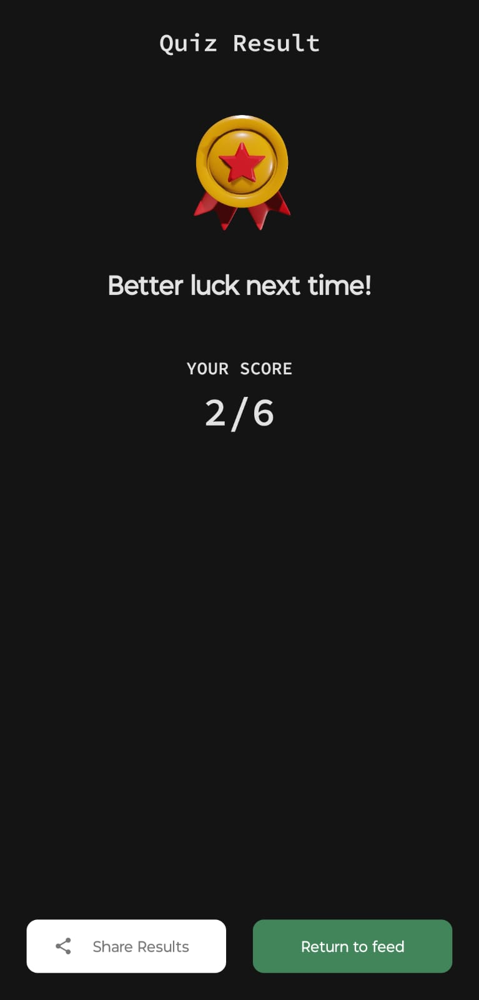 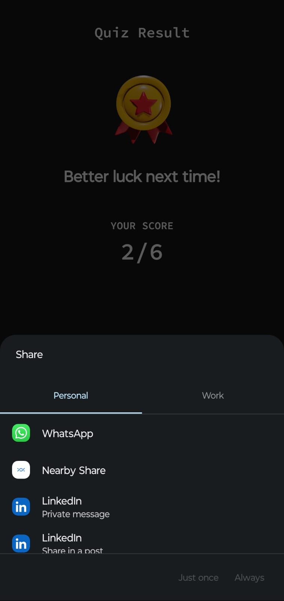 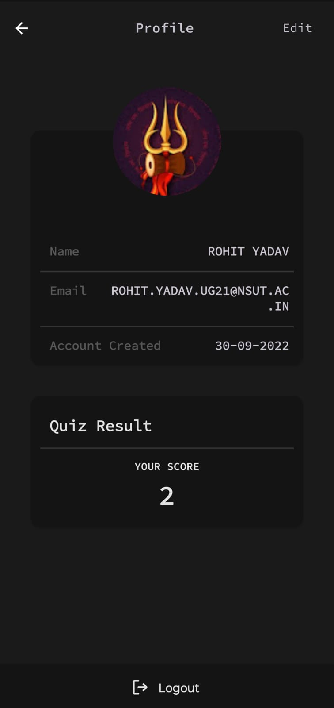 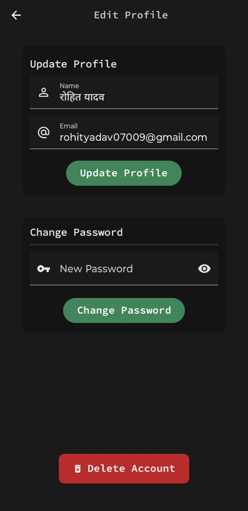 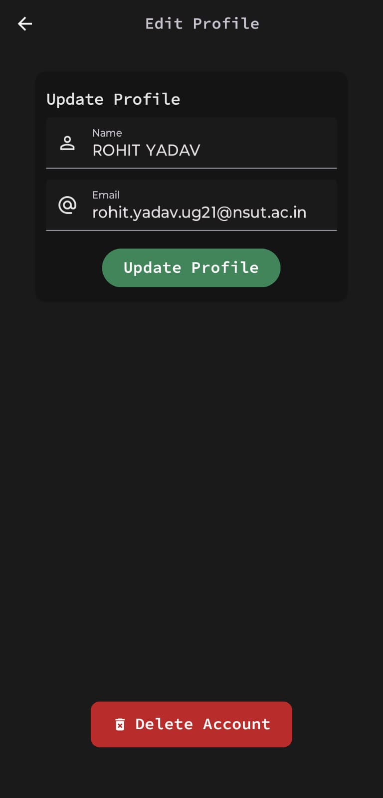 

### Library and Dependencies Used 🔗
- [Kotlin](https://kotlinlang.org)
- Retrofit
- Coroutines
- Gson library for JSON parsing
- Navigation Components
- Coil for Image Loading
- ViewBinding
- Material Design 3

## Known Issues
- None

